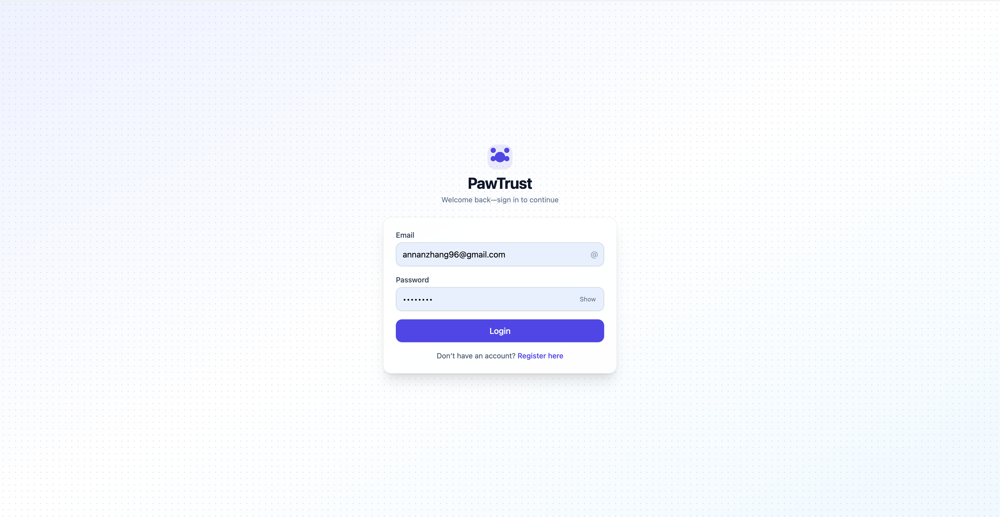
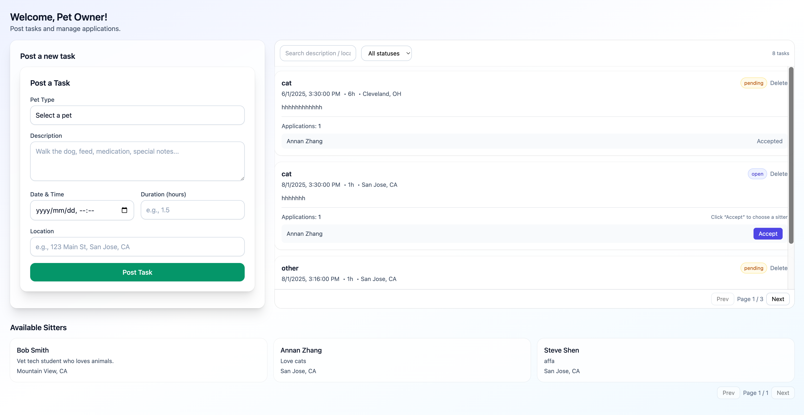
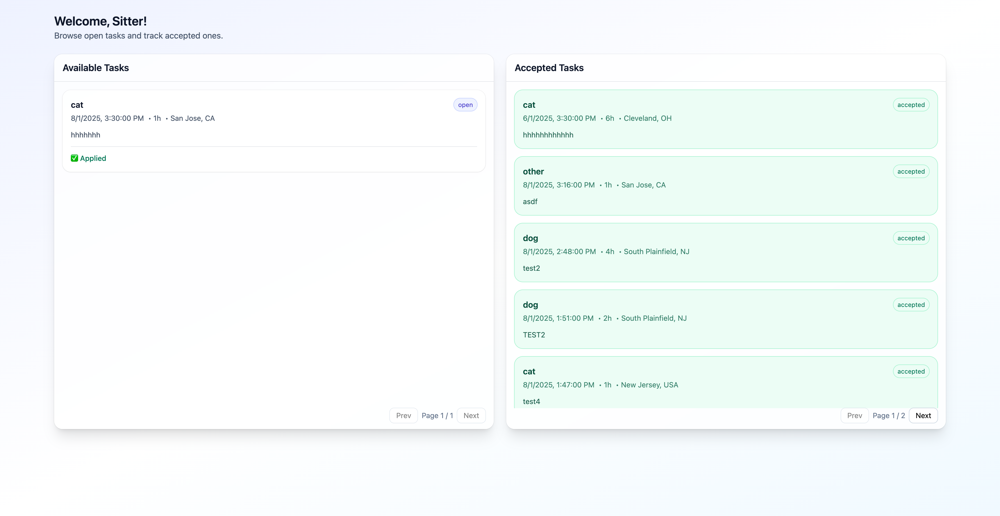

# Iter2 Team: PerfectWeb

## Project Name: PawTrust

### Team Members

- **Sihui Lyu**

---

## Project Description

**PawTrust** is a MERN stack web application that connects **pet owners** with **trustworthy pet sitters**.  
Pet owners can post pet care tasks, and sitters can browse and apply for these tasks.

The platform aims to:

- Help pet owners find reliable care for their pets quickly.
- Give part-time sitters (students, freelancers, etc.) flexible work opportunities.

---

## Iteration 2 Progress

In this iteration, we focused on **building core functionalities**, improving the UI, and deploying a working version to production.

### **1. Task Management (CRUD)**

- Implemented backend APIs for **create, read, update, delete** operations using MongoDB & Express.
- Added **authorization logic** so only task owners can create or delete their own tasks.

### **2. Owner Dashboard**

- Created an **Owner Dashboard** to display posted tasks in a **paginated list**.
- Added **application management**:
  - View all sitter applications per task.
  - Accept **only one sitter** per task.
- Updated task and application lists **in real time** after changes.

### **3. Sitter Dashboard**

- Built a **task browsing system** that shows only **open/available tasks**.
- Enabled **application submission** with an optional message to the task owner.
- Added a **separate “Accepted Tasks” section** so sitters can easily track confirmed jobs.
- Applied **two-column responsive layout** with **fixed-height scrollable cards**.

### **4. UI/UX Improvements**

- Used **Tailwind CSS** for a clean, responsive, modern design.
- Designed consistent layouts:
  - **Owner Dashboard:** Post Task + Available Tasks in one row, Available Sitters in a full-width row below.
  - **Sitter Dashboard:** Available Tasks on the left (3 per page), Accepted Tasks on the right (6 per page).
- Ensured components have **consistent height**, even when the number of tasks varies.

### **5. Backend–Frontend Integration**

- Integrated frontend React components with backend Express APIs.
- Used `fetch` for API calls with proper success/error feedback.
- Handled **state updates** so UI reflects backend changes instantly.

### **6. Deployment**

- Deployed both **frontend** and **backend** to **Google Cloud App Engine**.
- Configured **CORS** and environment variables for production deployment.

---

## Screenshots

### Login Review

### Owner Dashboard Review

### Sitter Dashboard Review

## Deployed Links

- **Frontend:** [https://pawtrust.uw.r.appspot.com](https://pawtrust.uw.r.appspot.com)
- **Backend API:** [https://pawtrust-backend.uw.r.appspot.com/pawtrust/tasks/available](https://pawtrust-backend.uw.r.appspot.com/pawtrust/tasks/available)

---

## GitHub Repositories

- **Frontend:** [https://github.com/BeautySharon/CS5610_Final_Project/tree/main/pawtrust-frontend](https://github.com/BeautySharon/CS5610_Final_Project/tree/main/pawtrust-frontend)
- **Backend:** [https://github.com/BeautySharon/CS5610_Final_Project/tree/main/pawtrust-backend](https://github.com/BeautySharon/CS5610_Final_Project/tree/main/pawtrust-backend)

---

## Next Steps

- Implement **task editing** for owners.
- Add **review and rating system** for sitters.
- Integrate **calendar view** for scheduled tasks.
- Continue **improving UI**.

---

# Iter1 Team: PerfectWeb

# PawTrust

PawTrust is a **MERN stack SaaS application** that connects **pet owners** with **pet sitters**. Owners post tasks (walks, feeding, daycare) and sitters apply. Owners can review applications and accept one sitter per task.

---

## Demo / Links

- **Frontend (GCP App Engine):** https://pawtrust.uw.r.appspot.com
- **Backend API (GCP App Engine):** https://pawtrust-backend.uw.r.appspot.com/pawtrust/tasks/available
- **Repos**
  - Frontend: https://github.com/BeautySharon/CS5610_Final_Project/tree/main/pawtrust-frontend
  - Backend: https://github.com/BeautySharon/CS5610_Final_Project/tree/main/pawtrust-backend

---

## Screenshots

### Login Review

### Owner Dashboard Review

### Sitter Dashboard Review

---

## Features in Iteration 1

- Set up the project repositories (frontend and backend) on GitHub

- Established Google Cloud deployment for both frontend and backend

- Implemented basic routing in React for Login, Register, Profile Setup, and Dashboard pages

- Connected backend API with MongoDB

- Added email/password authentication and session persistence with localStorage

- Created Owner Dashboard and Sitter Dashboard

---

## Next Steps

- Implement **CRUD operations** for tasks (create, read, update, delete)
- Build **Owner Dashboard** to manage tasks and sitter applications
- Create **Sitter Dashboard** to browse and apply for tasks

---

## Tech Stack

**Frontend:**

- React
- React Router
- Bootstrap
- Fetch API

**Backend:**

- Node.js
- Express
- MongoDB

**Deployment:**

- Google Cloud

**Other:**

- JWT Authentication
- LocalStorage
