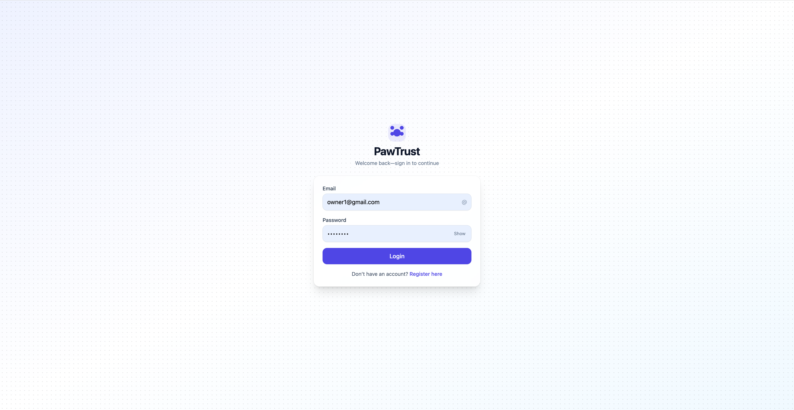
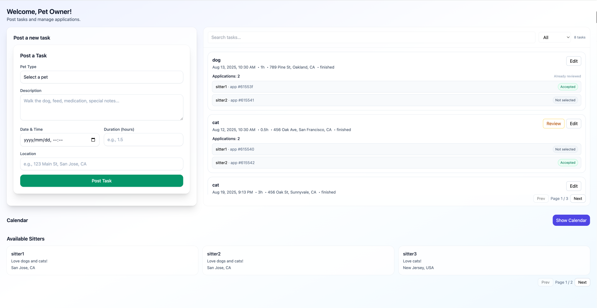

# 🐾 PawTrust 🐾

PawTrust is a MERN stack web application that connects **pet owners** with trustworthy **pet sitters**. Owners can post pet care tasks, review and accept applications, while sitters can apply for tasks, complete them, and receive reviews.

---

## Features

- **User Authentication**

  - Email/Password login
  - Role selection: Owner or Sitter
  - Sample testing accounts provided

- **Task Management**

  - Owners: Post, edit, and delete tasks
  - Sitters: Browse and apply for open tasks
  - Owners accept applications (one sitter per task)
  - Sitters mark accepted tasks as finished
  - Owners leave reviews after completion

- **Calendar Integration (Implemented using the third-party React library [FullCalendar](https://fullcalendar.io/))**

  - View all tasks by date
  - Post tasks directly from the calendar view

- **Reviews & Ratings**

  - Owners can review sitters after task completion
  - Reviews appear in sitters’ **Finished & Reviews** section

- **Responsive UI**
  - Built with Tailwind CSS for mobile and desktop

---

## Screenshots Overview

Below are the main views of **PawTrust**:

### **Home Page**

### **Owner Dashboard**

### **Sitter Dashboard**

---

# For a detailed user guide with full instructions and more screenshots, please refer to the User Guide PDF:

[https://docs.google.com/document/d/1Iss2T72vSEq4-krnOlWMqNabvPXAXoBrTseXnCKdLxE/edit?usp=sharing](https://docs.google.com/document/d/1Iss2T72vSEq4-krnOlWMqNabvPXAXoBrTseXnCKdLxE/edit?usp=sharing)

# Demo Link

[https://www.youtube.com/watch?v=ip4S6lbtx08](https://www.youtube.com/watch?v=ip4S6lbtx08)

---

# Deployed Links

- **Frontend:** [https://pawtrust.uw.r.appspot.com](https://pawtrust.uw.r.appspot.com)
- **Backend API:** [https://pawtrust-backend.uw.r.appspot.com/pawtrust/tasks](https://pawtrust-backend.uw.r.appspot.com/pawtrust/tasks)

---

# GitHub Repositories

- **Frontend:** [https://github.com/BeautySharon/CS5610_Final_Project/tree/main/pawtrust-frontend](https://github.com/BeautySharon/CS5610_Final_Project/tree/main/pawtrust-frontend)
- **Backend:** [https://github.com/BeautySharon/CS5610_Final_Project/tree/main/pawtrust-backend](https://github.com/BeautySharon/CS5610_Final_Project/tree/main/pawtrust-backend)

---

# Development Iterations

### **Iteration 1 – Project Setup & Basic Framework**

- Set up **frontend** (React + Vite) and **backend** (Express + MongoDB) repositories on GitHub.
- Configured **Google Cloud App Engine** deployment for both frontend & backend.
- Built **basic routing** in React for:
  - Login
  - Register
  - Profile Setup
  - Dashboard pages
- Implemented **email/password authentication** with session persistence (`localStorage`).
- Created initial **Owner Dashboard** & **Sitter Dashboard** layouts.

---

### **Iteration 2 – Core Features & UI Enhancement**

- **Task Management (CRUD)**: Backend APIs for create, read, update, delete tasks.
- **Authorization**: Only owners can manage their own tasks.
- **Owner Dashboard**:
  - Post new tasks.
  - View sitter applications.
  - Accept **only one** sitter per task.
- **Sitter Dashboard**:
  - Browse available tasks.
  - Apply for tasks with optional message.
  - View **Accepted Tasks**.
- **UI/UX Improvements**:
  - Tailwind CSS styling.
  - Responsive layout & consistent component height.

---

### **Iteration 3 – Advanced Features & Final Delivery**

- Added **Finish Task** feature:
  - Sitters can mark accepted tasks as **Finished**.
  - Owners can leave reviews for **Finished** tasks.
- Implemented **Review System**:
  - Owners’ reviews are stored and displayed in sitter’s dashboard.
- **Calendar Integration** (third-party React library):
  - Owners can view and post tasks directly from the calendar.
  - Easy scheduling and booking management.
- Final **UI polish** and bug fixes.
- Completed **User Guide** (PDF) and project documentation.

---

## Tech Stack

**Frontend**

- React + Vite
- Tailwind CSS
- FullCalendar (third-party React library)

**Backend**

- Node.js + Express
- MongoDB
- DAO pattern
- RESTful API

**Deployment**

- Google Cloud App Engine
- MongoDB Atlas

---
