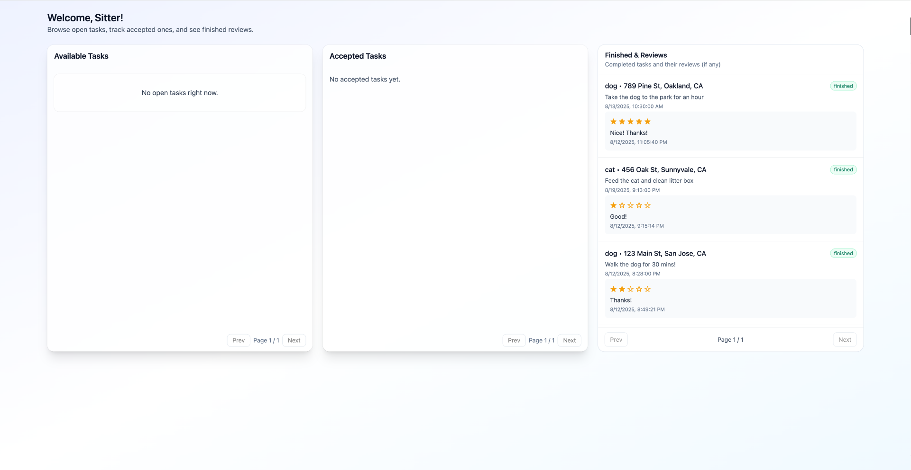

# PawTrust

PawTrust is a **MERN stack SaaS application** that connects **pet owners** with **pet sitters**. Owners post tasks (walks, feeding, daycare) and sitters apply. Owners can review applications and accept one sitter per task.

---

## Demo / Links

- **Frontend (GCP App Engine):** https://pawtrust.uw.r.appspot.com
- **Backend API (GCP App Engine):** https://pawtrust-backend.uw.r.appspot.com/pawtrust/tasks/available
- **Repos**
  - Frontend: https://github.com/BeautySharon/CS5610_Final_Project/tree/main/pawtrust-frontend
  - Backend: https://github.com/BeautySharon/CS5610_Final_Project/tree/main/pawtrust-backend

---

## 📸 Screenshots

### Login Review

### Owner Dashboard Review

### Sitter Dashboard Review

---

## 📂 Features in Iteration 1

- Set up the project repositories (frontend and backend) on GitHub

- Established Google Cloud deployment for both frontend and backend

- Implemented basic routing in React for Login, Register, Profile Setup, and Dashboard pages

- Connected backend API with MongoDB

- Added email/password authentication and session persistence with localStorage

- Created Owner Dashboard and Sitter Dashboard

---

## 📌 Next Steps

- Implement **CRUD operations** for tasks (create, read, update, delete)
- Build **Owner Dashboard** to manage tasks and sitter applications
- Create **Sitter Dashboard** to browse and apply for tasks

---

## 🛠️ Tech Stack

**Frontend:**

- React
- React Router
- Bootstrap
- Fetch API

**Backend:**

- Node.js
- Express
- MongoDB

**Deployment:**

- Google Cloud

**Other:**

- JWT Authentication
- LocalStorage
